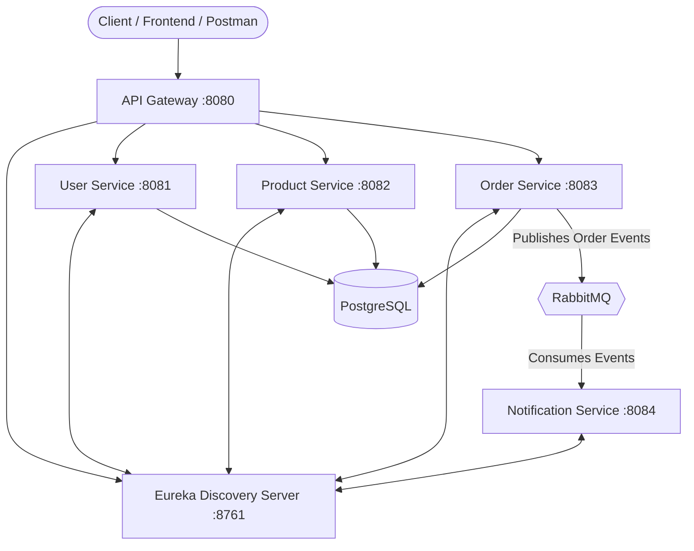

# E-Commerce Order Management System (OMS)

Welcome to the E-Commerce OMS! This project is a complete, production-ready Microservices Architecture built with Java, Spring Boot, PostgreSQL, and RabbitMQ.

## 🏗️ Architecture

Below is a diagram of how all the pieces connect together:



## 🚀 How to Run

Because this project is fully Dockerized, you **do not** need to install Java, Maven, PostgreSQL, or RabbitMQ on your local machine to run it!

1. Open your terminal in the root directory (`ecommerce-oms`).
2. Run the magic command:
   ```bash
   docker-compose up --build
   ```
3. Docker will automatically download the required software, compile all the Java microservices, initialize the databases, and start the entire network.

*(To stop the system, simply press `Ctrl + C` in the terminal).*

## 🔌 Important Endpoints

Once the system is running, you can access the following dashboards and endpoints:

- **API Gateway (Main Entry Point):** `http://localhost:8080`
- **Eureka Server Dashboard:** `http://localhost:8761`
- **RabbitMQ Management UI:** `http://localhost:15672` (Login: guest/guest)

### Swagger API Documentation
You can explore and test the REST APIs directly in your browser!
- **User Service Docs:** `http://localhost:8081/swagger-ui.html`
- **Product Service Docs:** `http://localhost:8082/swagger-ui.html`
- **Order Service Docs:** `http://localhost:8083/swagger-ui.html`

## 🛠️ Tech Stack
- **Java 17** & **Spring Boot 3.2**
- **Spring Cloud** (Netflix Eureka, Spring Cloud Gateway, OpenFeign)
- **Database:** PostgreSQL
- **Message Broker:** RabbitMQ
- **Security:** Spring Security & JWT
- **Documentation:** SpringDoc OpenAPI (Swagger)
- **Testing:** JUnit 5 & Mockito
- **Deployment:** Docker & Docker Compose

## ☁️ Deployment on Microsoft Azure

This architecture is optimized to run on a single **Microsoft Azure Ubuntu Linux VM** (e.g., `Standard_B2ms`) using Docker Compose. 

### Architecture Summary
- **Public Entry Point:** All external traffic routes exclusively through the API Gateway (Port `8080`).
- **Internal Network:** Microservices, PostgreSQL, and RabbitMQ communicate securely via Docker's internal bridge network. Sensitive ports are **not** exposed to the public internet.

### High-Level Deployment Steps
1. Provision an **Ubuntu 22.04 LTS** VM on Microsoft Azure (recommend `Standard_B2ms`).
2. Add an Inbound Port Rule in the Azure Network Security Group (NSG) to allow TCP traffic on port `8080`.
3. SSH into the VM, install Docker, and clone this repository.
4. Copy `.env.example` to `.env` and fill in secure credentials.
5. Run the deployment:
   ```bash
   docker compose up --build -d
   ```
6. Access the live API at `http://<YOUR_AZURE_PUBLIC_IP>:8080/`.
